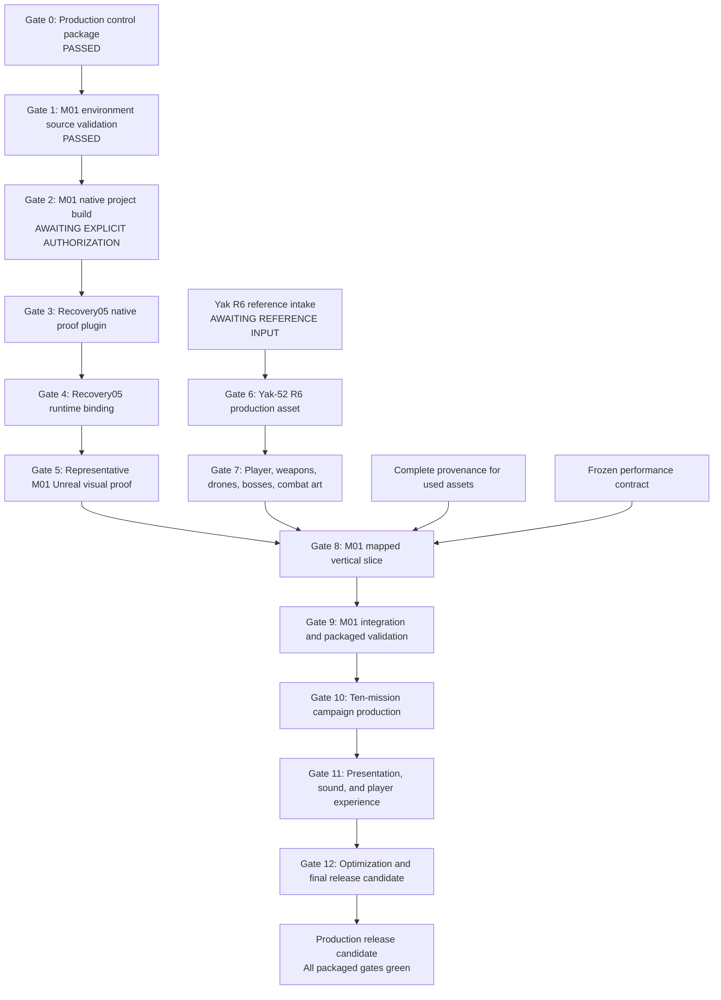

# Skyguard 52 AAA Production Dependency Graph — Gate 0

Generated: 2026-08-04  
Project authority: `D:\Skyguard52`

This graph governs the current Unreal Engine 5.8 and Blender production track. The retired Three.js build is outside scope.

## Critical path

| Order | Gate | Current classification | Unlock condition | Heavy-process authorization |
|---:|---|---|---|---|
| 0 | Production control | `PASSED` | Frozen Gate 0 package | No |
| 1 | M01 source validation | `PASSED` | Frozen validation-recovery evidence | No |
| 2 | M01 native project build | `AWAITING_NEXT_EXPLICIT_GATE` | User authorizes the frozen one-shot prompt | Yes |
| 3 | Recovery05 proof plugin build | `AWAITING_NEXT_EXPLICIT_GATE` | Gate 2 passes; separate build prompt frozen and authorized | Yes |
| 4 | Recovery05 runtime binding | `AWAITING_NEXT_EXPLICIT_GATE` | Accepted plugin binary and exact inputs | Offline design first; Unreal later |
| 5 | Representative M01 visual proof | `AWAITING_NEXT_EXPLICIT_GATE` | Gate 4 passes and one-shot Unreal execution is authorized | Yes |
| 6 | Yak-52 R6 | `AWAITING_NEXT_EXPLICIT_GATE` | Reference intake becomes sufficient; Blender contract frozen and authorized | Yes |
| 7 | Close-view combat art | `AWAITING_NEXT_EXPLICIT_GATE` | Accepted Yak/cockpit spatial contract and art contracts | Blender/Unreal gates individually |
| 8 | M01 vertical slice | `AWAITING_NEXT_EXPLICIT_GATE` | Gates 5 and 7 pass; provenance complete for used assets | Integration authorization required |
| 9 | M01 packaged validation | `AWAITING_NEXT_EXPLICIT_GATE` | Gate 8 passes | Packaging authorization required |
| 10 | Campaign production | `AWAITING_NEXT_EXPLICIT_GATE` | M01 slice establishes the approved asset and performance language | Per-wave authorization |
| 11 | Presentation/audio | `AWAITING_NEXT_EXPLICIT_GATE` | Production mission flows and audio asset provenance exist | Integration/package gates |
| 12 | Release candidate | `AWAITING_NEXT_EXPLICIT_GATE` | Every prior production and packaged gate passes | Build/package/profiling authorization |

## Parallel-safe offline lanes

The following may proceed while Gate 2 awaits authorization, provided they do not mutate frozen inputs or launch heavy processes:

- Reference and dimensional intake for Yak-52 R6.
- License receipt collection and asset-source normalization.
- Mission-specific route, objective, boss, art, sound, and acceptance contracts.
- Test design, capture-camera design, performance rubrics, and packaging checklists.
- Failure reconciliation and audit maintenance.

## Serialized heavy lanes

Only one of these may run at a time:

- Unreal native project build.
- Recovery plugin build.
- UnrealEditor or UnrealEditor-Cmd proof.
- Blender production or render.
- Shader compilation.
- Import, integration, packaging, or profiling.

Every failed heavy namespace is terminal. A failure can only lead to a separately designed, separately frozen, explicitly authorized recovery.

## Gate dependencies that cannot be bypassed

1. File presence does not substitute for direct visual acceptance.
2. Editor evidence does not substitute for packaged-game evidence.
3. The Phase 8 proxy baseline does not substitute for current final-content performance.
4. A successful native build does not accept the visual result.
5. A successful visual proof does not accept gameplay, audio, input, combat, performance, or release readiness.
6. M01 must become a production-quality packaged vertical slice before its visual and technical language is propagated to Missions 2–10.
